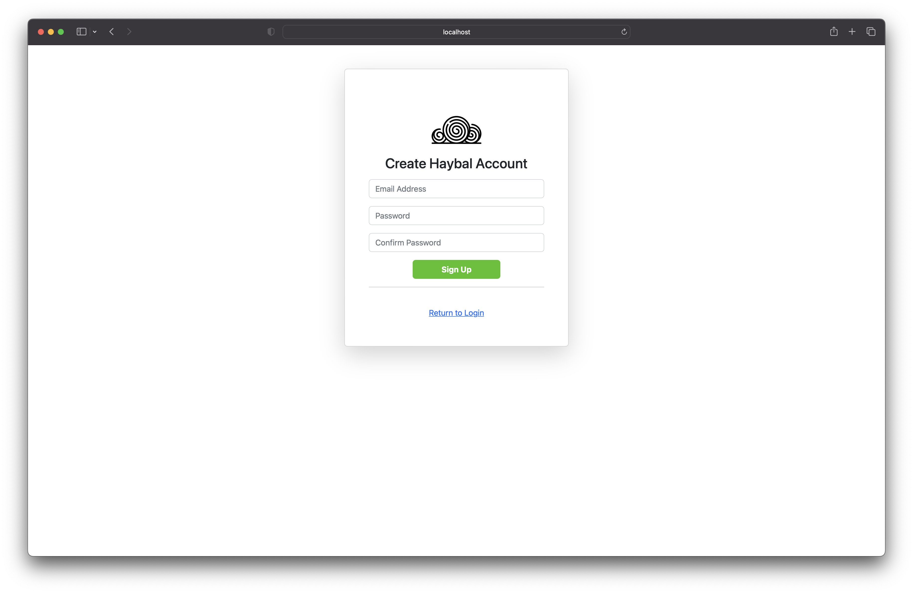
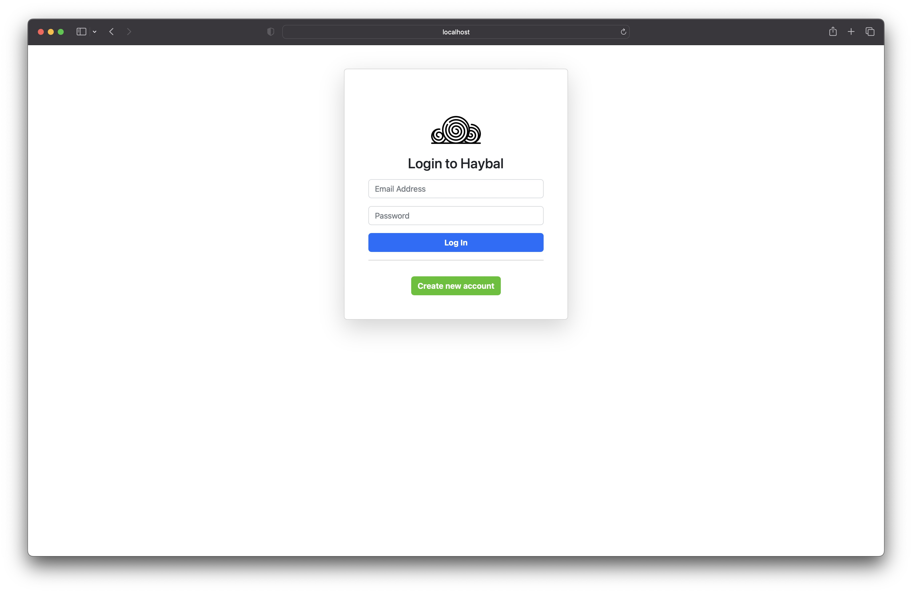
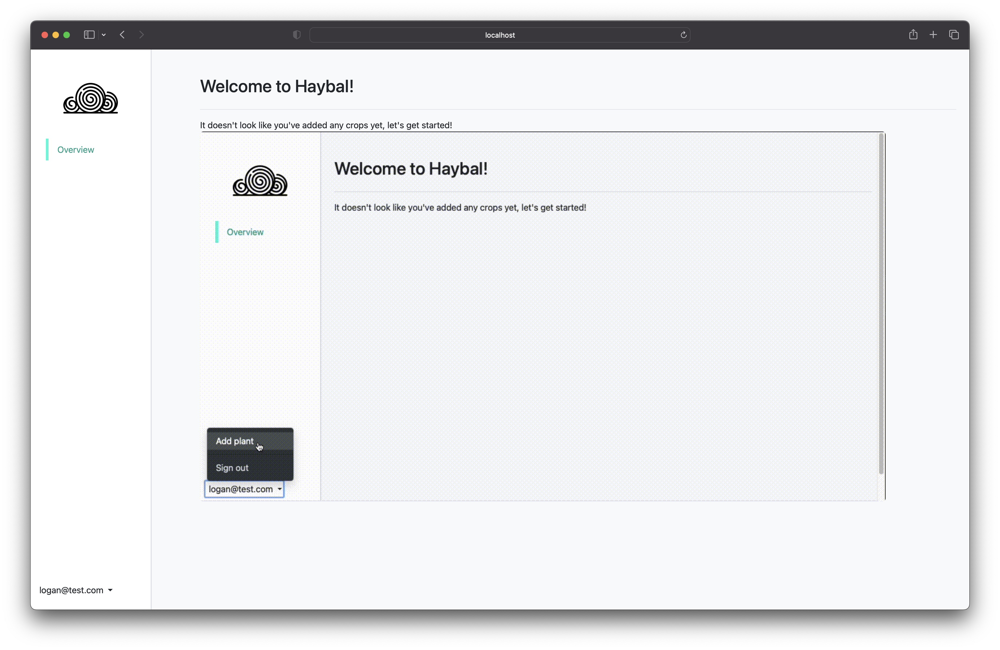
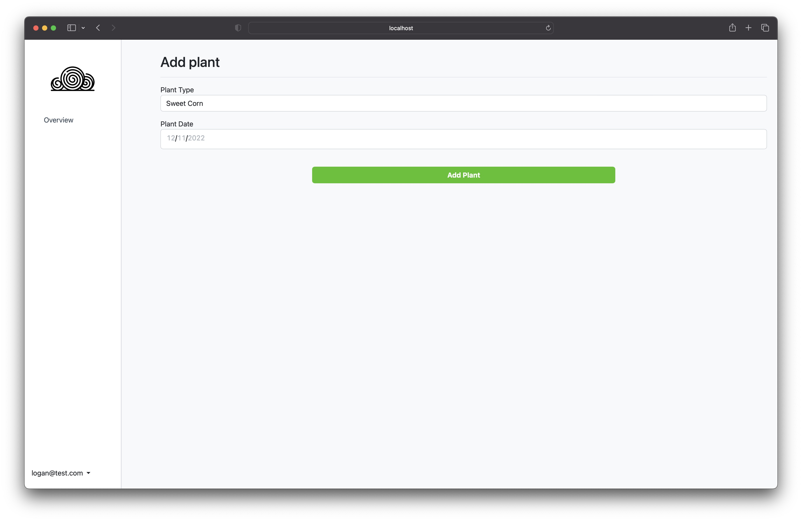
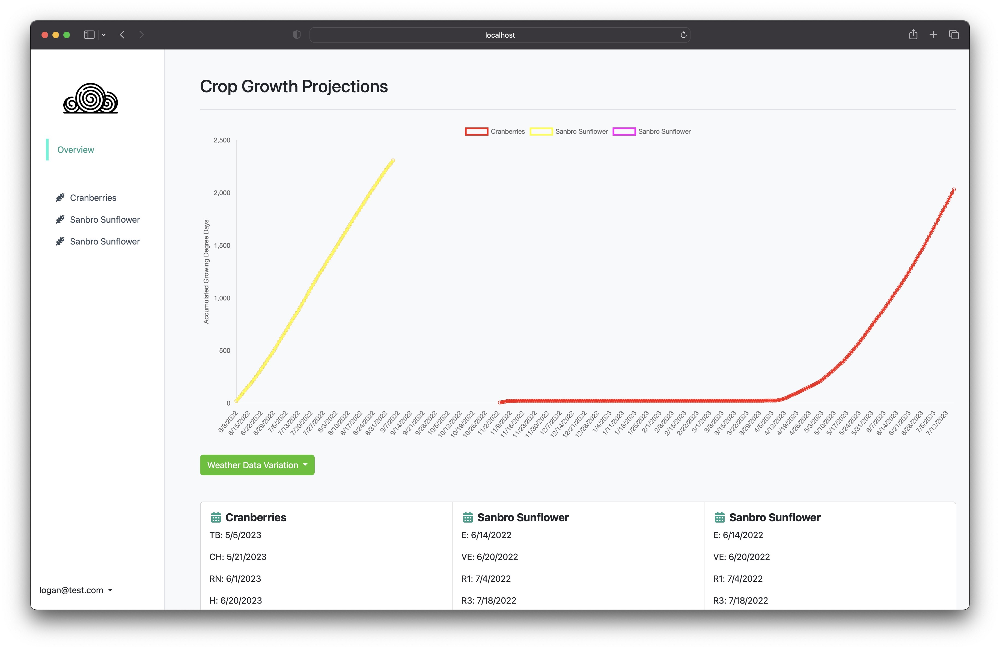
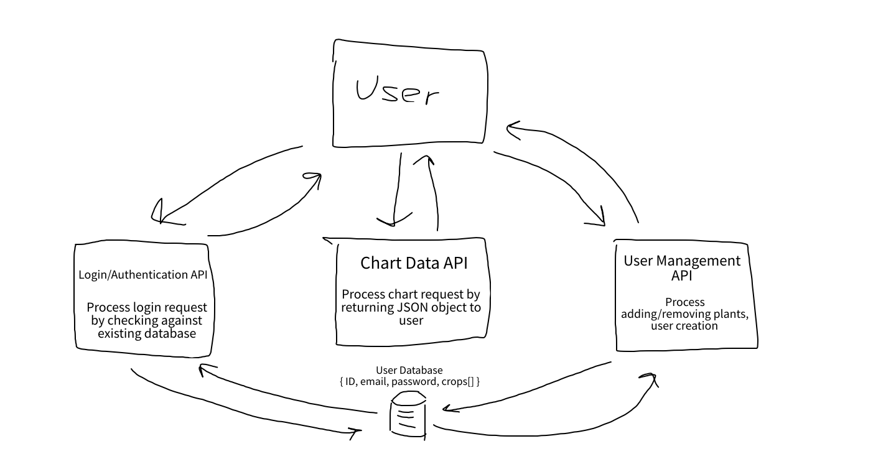

# Team Vav | Haybal | Fall 2022

## Overview

According to the American Society of Agronomy, [crop yield prediction remains one of the most challenging tasks in agriculture](https://www.mdpi.com/journal/agronomy/special_issues/cropprediction_precisionagriculture#:~:text=Crop%20yield%20prediction%20is%20one,%2C%20environmental%2C%20and%20crop%20parameters.). For a farmer, the benefits of precision agriculture include an increase in crop yield and crop quality which translates to an increase in profits. Existing precision agricultural systems leverage expensive sensing technologies, information systems, and variable rate technologies to maximize crop yield. 

Our application is a crop growth predictor that supports 3 different types of crops: soybeans, sunflowers, and cranberries. We use 30 years of tempature data collected by [a weather station on UMass Amherst's campus](https://www.ncei.noaa.gov/cdo-web/datasets/GHCND/stations/GHCND:USC00190120/detail). Using a crops base tempature, max tempature, and freeze tempature combined with our weather model, we are able to predict how many growing degree units a crop will get on any particular day using historical averages. The 3 crops we picked have well documented quantities of culmative growing degree units for each of there vegetative stages, most importantly physiological maturity. Using all this informatio plus a plant date, we can display when a plant will reach its final growth stage and be ready for harvest and compare different growing options.

Our application is innovative because there does not currently exist an application to predict the growth of multiple types of crops, compare crop growing options, or change the weather data used in the prediction process.

## Team Members

Logan Mimaroglu ([@gluestix](https://github.com/gluestix))
Stephen Lee ([@stephen-lee-cs](https://github.com/stephen-lee-cs))
Justin Szymanski ([@justinszy](https://github.com/justinszy))

## User Interface

### Create Account Page

This page lets the user create a new account.

### Login Page

This let's the user login to there account.

### No Crops Page

This page is displayed to people with no added crops, such as new users. And it displays a GIF informing them how to add crops.

### Add Plant Page

This page is displayed after clicking the add plant button and lets a user add a crop to there account.

### Dashboard Page

This page shows how a plan will grow in terms of its growing degree units. The cards at the bottom of the page show the dates that vegetative stages will be reached based on when they plant the crop.

### Single Plant Page

This view is shown when you want to focus in on a single plant. Very similar to the dashboard page but focuses on a single plant.

## APIs

For our project we've created three RESTful API's through the use of Express.js. 

The first API serves as our endpoint for user login and authentication. When a user attempts to log in with their entered email address and password, this information will be received in the form of a POST request and checked against existing users in the database. Each user is assigned an index i, and upon successful login the user will be redirected to .../users/i.

The second API serves as our endpoint for providing chart information to the user. When a user attempts to view a specific plants chart, they will make a request to the server for .../users/i/crop?=id and in turn will receive the chart data for the crop with that id. This data will be received in the form of a POST request containing a stringified JSON object.

The third API serves as our endpoint for user customization, such as adding/removing specific plants views to/from their profile. Adding plant views will be received in the form of POST requests, and upon receiving the request a new crop will be created and stored in the backend database as a JSON object. Removing plant views will be received in the form of DELETE requests, and upon receiving this request the plant's JSON object will be removed from the database. This API will also handle new user creation: requests will be received from ...users/new and a new user will be subsequently stored in the database. Users are stored as JSON objects containing their email address, password, and crop data.

Below is a flow chart demonstrating these three API endpoints:

## Database

We implemented a PostgreSQL database. We created three tables Users, Crops and Weather.

### Users table

| Column   | Data Type | Description                       |
| -------- | --------- | --------------------------------- |
| id       | integer   | unique id of a user               |
| email    | String    | email of user                     |
| password | String    | hash password + salt              |
| crops    | String    | array of plants, refrencing crops |

### Crops table

| Column        | Data Type | Description                             |
| ------------- | --------- | --------------------------------------- |
| id            | integer   | id of plant, refrenced by users, unique |
| type          | String    | type of crop                            |
| growth_stages | json      | detailed info on crop stage             |
| plant_date    | date      | date of plant                           |
| base_temp     | integer   | temp needed for plant growth            |
| freeze_temp   | integer   | temp were plant stops growing           |
| location      | String    | location of crop                        |

### Weather table

| Column   | Data Type | Description                                                        |
|----------|-----------|--------------------------------------------------------------------|
| station  | String    | weather station from which the measurement was taken               |
| name     | String    | name of the weather station (usually a human-readable location)    |
| date     | date      | date in zulu time                                                  |
| tmax     | integer   | max tempature for the day                                          |
| tmin     | integer   | min tempature for the day                                          |

## URL Routes

| Endpoint                   | Type   | Auth | Description                                                  |
| -------------------------- | ------ | ---- | ------------------------------------------------------------ |
| /users/new                 | GET    | No   | Displays the user creation page.                             |
| /users/dashboard           | GET    | Yes  | Displays the user's dashboard.                               |
| /users/dashboard           | POST   | Yes  | Add's a crop to a user's list of crops.                      |
| /users/dashboard           | DELETE | Yes  | Remove's a crop from a user's list of a crops.               |
| /users                     | POST   | No   | Create's a new user.                                         |
| /                          | GET    | No   | Login page.                                                  |
| /login                     | POST   | No   | Authenticates a user and redirects them to either try again or to there dashboard. |
| /users/dashboard/logout    | POST   | No   | Logs a user out if they are logged in.                       |
| /users/dashboard/add-plant | GET    | Yes  | Displays the add plant page.                                 |
| /model                     | POST   | No   | Returns a JSON object containing the chart data to display.  |
| /model/deadlines           | POST   | No   | Returns a JSON object containing the import deadlines to display for the views. |

## Authentication

TODO: Stephen

## Divison of Labor

We used a private slack channel to communicate, we also met in person in the library throughout the semester to brainstorm and pair program.

### Logan Mimaroglu

I was responsible for the creation of the `dashboard.html` and `index.html` files as well as there corresponding JavaScript files, `dashboard.js` and `login.js`. I also created a the CSS styling `mystyle.css`. I worked with the team to create the Wireframe for the website. Worked with group to plan out API. Implemented the dashboard sidebar to dynamically display all plants a user has attached to their account using express js routing and EJS templating. Met in person to brainstorm and design database implementation. Designed and implemented crop growth projection model. Tied front end to this new model. Santized and imported weather data from NOAA into our PostgreSQL database.

### Stephen Lee

TODO: Stephen

### Justin Szymanski

TODO: Justin

## Conclusion

Working on this project was exteremly interesting. When we started knew as much about farming as we did about front-end web developement, which was not much. We set our expectations high in wanting to use a machine learning model for predicting crop growth. As we talked to farmers and researched more, we realized that farmers have been predicting crop growth for over a decade and without machine learning models. Instead, they used growing degree units. This is something that we wish we were aware from the onset instead of trying to reinvent the wheel about how crop growth is predicting. Ultimely this pivot away from machine learning allowed us to reach us more important goal of supporting more than 1 crop. We support soybeans, cranberries and sweet corn which are the top three most grown crops in western massachussets. Overall, we learning a lot about front end design, API design, how to structure and organize code, and how to organize and work with other software engineers.
