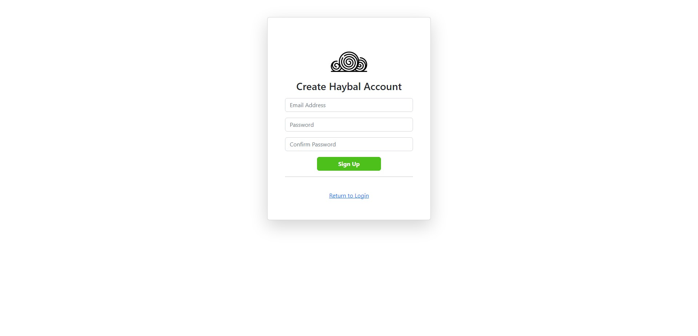
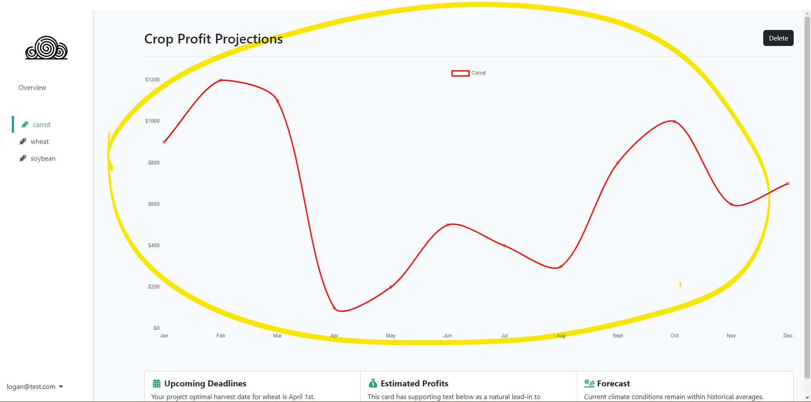
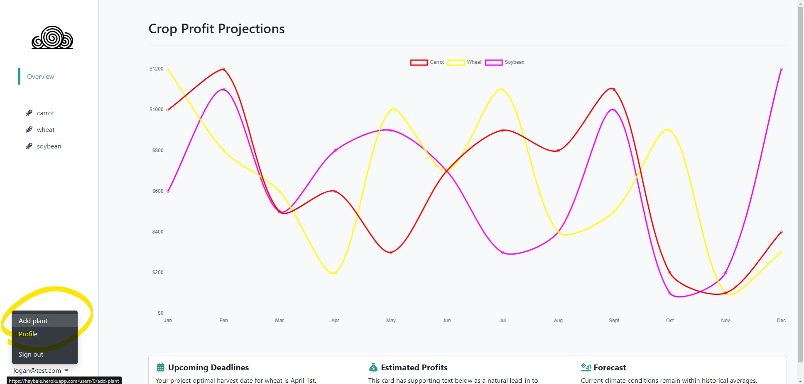
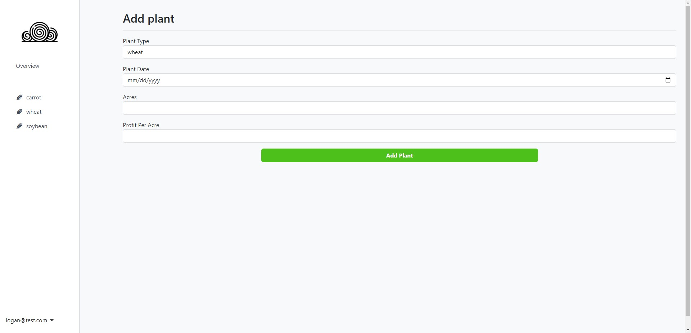
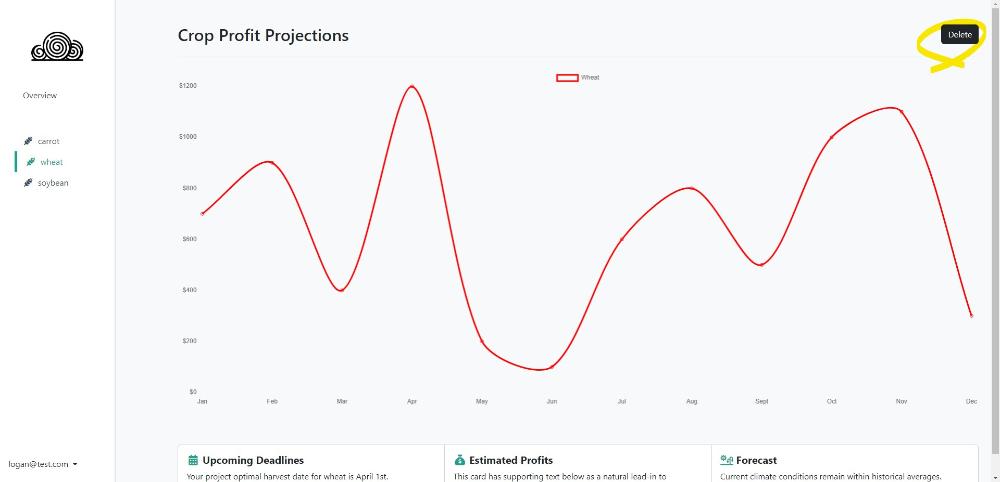

# Milestone 2

## Project API Planning

TODO

## Front-end Implementation

- CREATE
The create account page adds a new enrty in the form of a user. 

- READ
The data used to form the graph is retrieved from existing enteries. 

- UPDATE
The add plant button leads to a page where you can page that adds plants to existing users.   

- DELETE
Delete button allows users to remove plants 

## Deployment

Website link https://haybale.herokuapp.com/

## Breakdown of Division of Labor

we used a private slack channel to communicate, we also met in person at the library

### Logan Mimaroglu
TODO
### Stephen Lee
TODO
### Justin Szymanski
TODO
